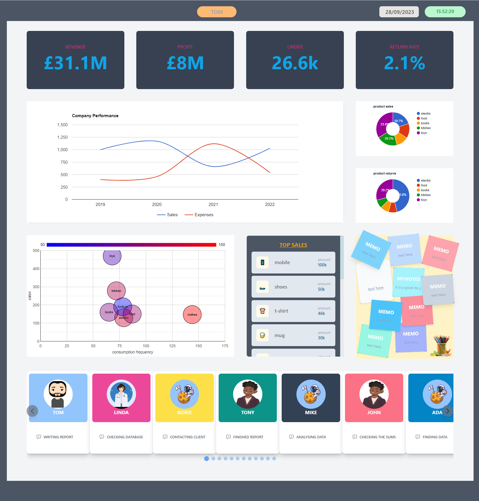

### Dashboard App
Demo: ![alt text][https://link-url-here.org](https://youtu.be/xF5Q0N9nltg)
## features:
 > - Full stack MERN project .
 > - Authentication with hashed password .
 > - Authorisation of multi-backend system with JWT . 
 > - Web scraping with beautifulsoup .
 > - Decrease data latency with Redis .
 > - Project management . 
 > - Data visualisation .

## how to run
 > - set up and connect redis and mongodb .
 > - creact user and admin data in mongodb .
 > - run npm install in react and nodejs folder .
 > - set up virtual environment for flask .
 > - run 'npm start' in nodejs, 'npm run dev' in react,  'flask run' in flask  .
